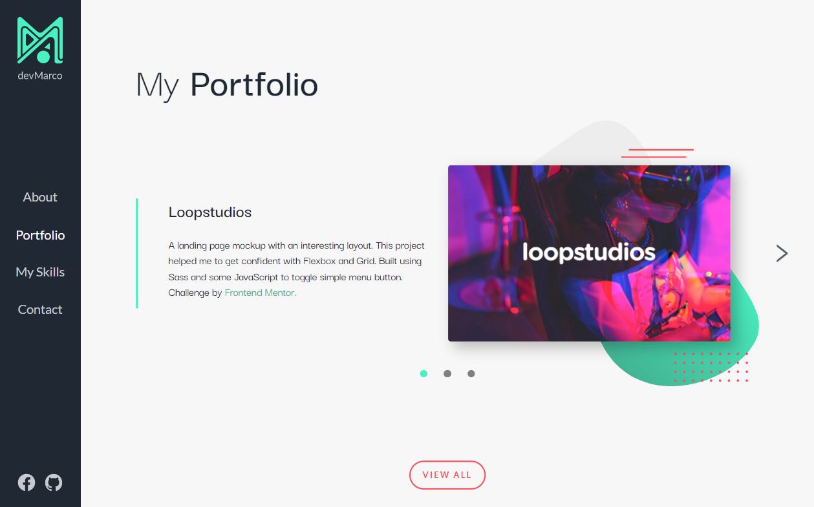
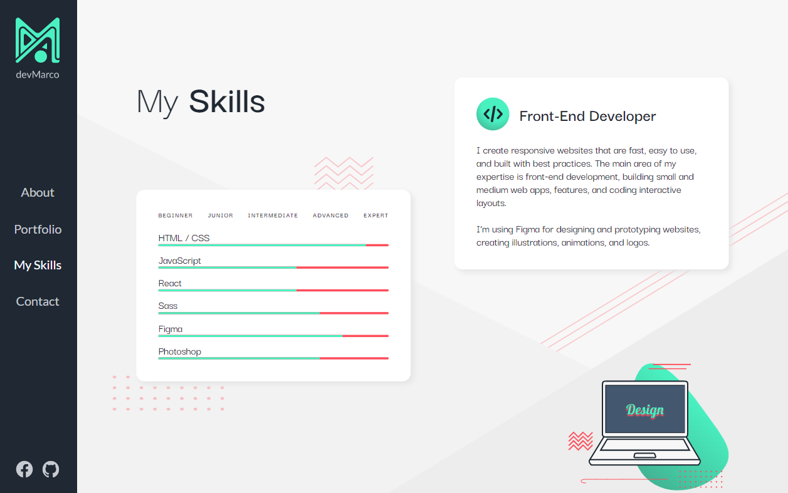
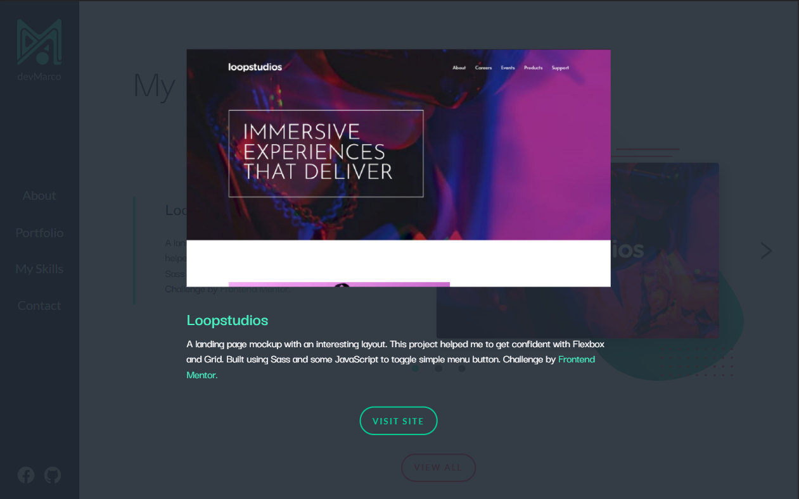
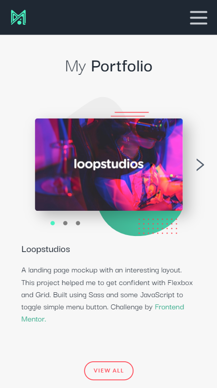

# devMarco Portfolio

This website provides professional information about Marco Polo Alpay and presents a showcase of his work.

## Table of contents

- [Screenshot](#screenshot)
- [Links](#links)
- [Built with](#built-with)
- [Author](#author)

## Overview

### Screenshot

### Links

- GitHub - [devMarco-Portfolio](https://github.com/devMarco02/devMarco-Portfolio)
- GitHub - [tip-calculator-app](https://github.com/devMarco02/tip-calculator-app)
- GitHub - [sunnyside-agency-landing-page](https://github.com/devMarco02/sunnyside-agency-landing-page)
- GitHub - [loopstudios-landing-page](https://github.com/devMarco02/loopstudios-landing-page)

## My process

### Built with

- Semantic HTML5 markup
- Sass
- GSAP
- Mobile-first workflow
- [React](https://reactjs.org/) - JS library
- [GSAP](https://greensock.com/gsap/) - JS library

## Author

- Website - [devMarco02](https://devmarco02.netlify.app/)
- GitHub - [devMarco02](https://github.com/devMarco02)
- Facebook - [Marco Alpay](https://web.facebook.com/MarcoAlpay)
- Frontend Mentor - [https://www.frontendmentor.io/profile/devMarco02](https://www.frontendmentor.io/profile/devMarco02)
